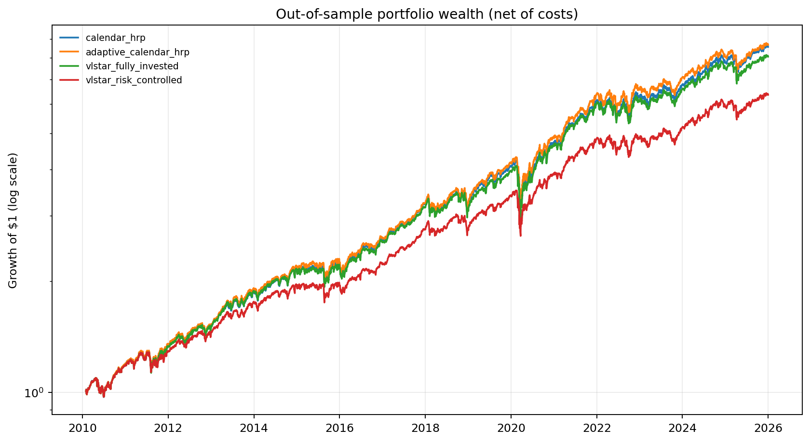

# Hierarchical Risk Parity Reproduction Project

This project is an auditable reproduction of three portfolio-research claims:

1. Hierarchical Risk Parity (HRP) versus a clearly defined risk-parity baseline
   in paired, out-of-sample multi-factor Student-*t* copula simulations.
2. Index-based, explicit-stack tree traversal versus the paper-style pandas
   quasi-diagonalization routine.
3. A restricted Vector Logistic Smooth Transition (VLSTAR-style) volatility
   model that changes HRP covariance estimates and rebalance timing.

The headline numbers **32%**, **4x**, **20%**, and **12%** are hypotheses, not
constants in the code. A run reports the numbers that actually occur, together
with sample definitions, confidence intervals where applicable, and a
pass/not-reproduced claim audit.

## Locked reproduction results

The completed CRSP reproduction used 500 paired Monte Carlo trials and a
2010--2025 common-window empirical backtest. It reproduced two of the four
headline targets without fitting the code to the desired numbers:

| Claim | Target | Measured | Audit |
|---|---:|---:|---|
| HRP out-of-sample variance reduction vs IVP | 32.0% | **1.69%** | Not reproduced |
| Legacy pandas to stack/index traversal speedup | 4.0x | **65.26x** | Reproduced |
| VLSTAR risk-controlled HRP Sharpe improvement | 20.0% | **-0.76%** | Not reproduced |
| VLSTAR risk-controlled HRP 95% ES reduction | 12.0% | **13.38%** | Reproduced |

The complete methodology, confidence intervals, benchmark definitions, and
limitations are in the [locked research report](outputs/hrp_reproduction_crsp_20260824/report.md).



Additional figures cover the [paired Monte Carlo variance comparison](outputs/hrp_reproduction_crsp_20260824/figures/monte_carlo_variance.png),
[regime probabilities](outputs/hrp_reproduction_crsp_20260824/figures/regime_probability.png),
and [tree-traversal benchmarks](outputs/hrp_reproduction_crsp_20260824/figures/traversal_speedups.png).

## Data decision

The preferred original setting is CSMAR ChiNext daily trading data. The WRDS
account used for this reproduction exposes the CSMAR catalog but is not
entitled to `csmar_trade`, so claiming a ChiNext result would be inaccurate.
The empirical run therefore uses the accessible **WRDS CRSP Annual Update,
Stock Version 2 (CIZ), Daily Stock File** for a fixed, diversified 32-security
query universe from 2006 through 2025; the predeclared coverage rule leaves a
complete 31-asset panel.

The fixed universe is suitable for reproducing and testing the algorithms, but
it is not a point-in-time index-membership backtest. The report labels the
result accordingly and does not infer investable performance for the entire
U.S. market. Raw WRDS data is licensed and excluded from versioned artifacts;
the run writes a hash, query ID, schema, row count, and date coverage instead.

Expected normalized fields are:

```text
permno, ticker, dlycaldt, dlyret, dlycap
```

The loader is case-insensitive and accepts the corresponding CRSP CIZ labels.

## Method definitions

The primary HRP variant follows López de Prado's original construction:

```text
d_ij = sqrt((1 - correlation_ij) / 2)
Z = linkage(pdist(D), method="single")
```

The direct condensed-distance variant is available as a sensitivity check.
Recursive bisection uses inverse-variance cluster variance. The primary
"traditional risk parity" comparator is the original paper's inverse-variance
portfolio (IVP); equal-risk-contribution (ERC) is reported separately as a
robustness benchmark so the term *risk parity* is never ambiguous.

The copula simulation is paired by design: HRP, IVP, and ERC see identical
training and test paths. Empirical marginals are coupled with a low-rank
Student-*t* dependence model. Portfolio weights are re-estimated every 21
forward test days from the preceding training window.

The regime layer is intentionally called **VLSTAR-style** rather than a full
maximum-likelihood VLSTAR implementation. It fits a restricted two-regime
logistic smooth-transition regression to lagged market variance,
cross-sectional dispersion, and mean correlation. The forecast transition
probability blends short- and long-half-life covariance estimates and drives a
hysteretic rebalance trigger. Signals use only information known at the prior
close, and transaction costs apply to drifted pre-trade weights.

## Environment and commands

Python 3.12+ is supported. Create an isolated environment and install the
package with its test dependencies:

```bash
python -m venv .venv
source .venv/bin/activate
python -m pip install -e ".[dev]"
pytest -q

PYTHONPATH=src python -m hrp_lab.cli \
  reproduce --config configs/crsp_reproduction.yaml
```

Useful focused commands are also available:

```bash
PYTHONPATH=src python -m hrp_lab.cli validate-data \
  --config configs/crsp_reproduction.yaml
PYTHONPATH=src python -m hrp_lab.cli monte-carlo \
  --config configs/crsp_reproduction.yaml
PYTHONPATH=src python -m hrp_lab.cli benchmark-tree \
  --config configs/crsp_reproduction.yaml
PYTHONPATH=src python -m hrp_lab.cli backtest \
  --config configs/crsp_reproduction.yaml
```

Each full run creates a timestamped folder under `outputs/` containing the
resolved configuration, data manifest, raw timing summaries, Monte Carlo
trials/summary, backtest returns and weights, figures, machine-readable metrics,
and a Markdown report. The raw WRDS extract is never copied to that folder.

## Claim conventions

- Variance reduction: `100 * (1 - mean(var_HRP) / mean(var_IVP))`.
- A 32% variance reduction is a variance ratio of 0.68, not 32% lower
  volatility.
- Traversal speedup: `median(legacy time) / median(stack time)`; 4x faster means
  75% less traversal time.
- Sharpe improvement: `100 * (Sharpe_regime / Sharpe_calendar - 1)` when the
  baseline Sharpe is positive; the absolute difference is also reported.
- Tail risk is daily 95% historical Expected Shortfall of positive loss.

## References

- Marcos López de Prado, [*Building Diversified Portfolios that Outperform Out
  of Sample*](https://papers.ssrn.com/sol3/papers.cfm?abstract_id=2708678).
- Sébastien Maillard, Thierry Roncalli, and Jérôme Teïletche,
  [*The Properties of Equally Weighted Risk Contribution Portfolios*](https://doi.org/10.3905/jpm.2010.36.4.060).
- Stefano Demarta and Alexander McNeil,
  [*The t Copula and Related Copulas*](https://doi.org/10.1111/j.1751-5823.2005.tb00254.x).
- Timo Teräsvirta and Yukai Yang,
  [*Specification, Estimation and Evaluation of Vector Smooth Transition
  Autoregressive Models*](https://pure.au.dk/ws/portalfiles/portal/73308642/rp14_08.pdf).
- Carlo Acerbi and Dirk Tasche,
  [*On the Coherence of Expected Shortfall*](https://doi.org/10.1111/1468-0300.00091).
